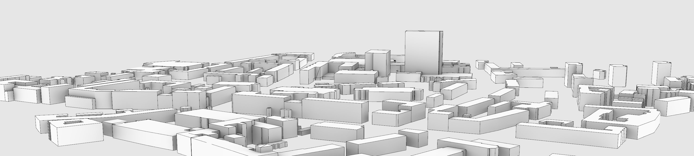

# 3D modeling with build123d

## Introduction

This repository contains a script that generates a 3D model with `Build123d` library. It's a model generated from building footprints from [Open Street Map (OSM)](https://www.openstreetmap.org) data. It uses floor levels information to approximate the height of these buildings.

### city.py

Script that fetches OSM (Open Street Maps) data of buildings and generates a 3D model.

OSM uses `labels` to organize the city data. I'm using the following ones:

- building - to fetch all buildings in the area, including footprints
- building:levels - to fetch number of floors of the building (more reliable than height of the building)

## Development guidelines

### Managing dependencies

I highly recommend using a [virtual environment](https://docs.python.org/3/library/venv).

Then, installing requirements should be as easy as running `pip install -r requirements.txt`. But `build123d` and `CadQuery` use quite a complex set of interdependencies. If you encounter any issues, follow the recommended way to install the `build123` package on [pypi](https://pypi.org/project/build123d/).

If you use Visual Studio Code, I recommend installing [OCP CAD Viewer](https://marketplace.visualstudio.com/items?itemName=bernhard-42.ocp-cad-viewer) extension to preview the model during development.

### Python version

Currently, `Build123d` doesn't support Python 3.13, that's why I'm using 3.12.

### Required:

- osmnx - to fetch and parse OSM data
- build123d - to make a 3D model based on OSM data

### Nice to have:

- ocp_vscode - part of a Visual Studio Plugin to preview the generated 3D model
- folium - to visualise OSM data on a map, to compare the results with the 3D model

## Attributions

This project was inspired by [Elk](https://www.food4rhino.com/en/app/elk). A plugin to Grasshopper that takes Open Street Maps (OSM) data and fetches outlines of buildings. I thought it would be interesting to try to recreate it in Python.

### Wonderfully documented libraries

- [Build123d](https://build123d.readthedocs.io/en/latest/index.html)
- [CadQuery](https://cadquery.readthedocs.io/en/latest/intro.html)
