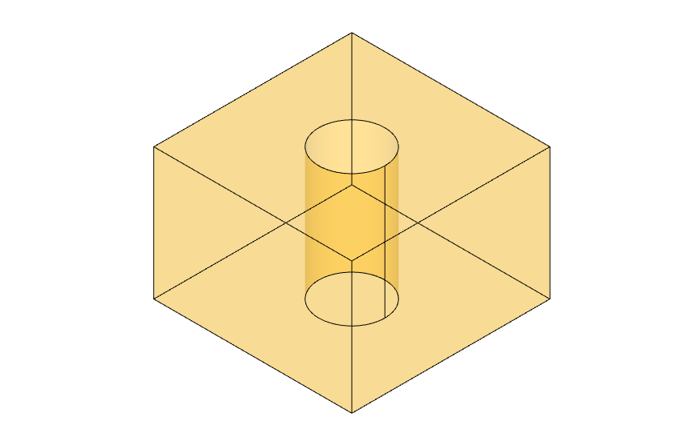

# Cube exercise

## Description

Simple exercise to make a cube with a hole using `Build123d` and `CadQuery`.

1. The cube's base is square
1. The hole's base is a circle
1. We want to input the following parameters:
   - r - radius of the hole
   - h - height of the cube
   - a - side of the cube

It is similar to modeling examples from documentation of these libraries:

- [Build123d](https://build123d.readthedocs.io/en/latest/index.html)
- [CadQuery](https://cadquery.readthedocs.io/en/latest/intro.html)
